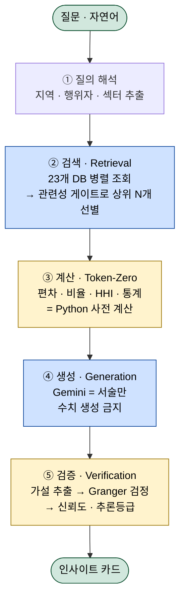
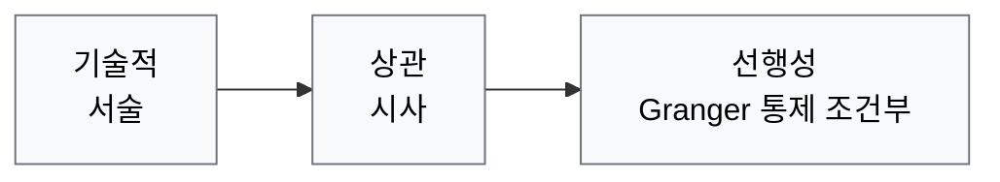

# 발표 — 러시아는 왜 우크라이나 전쟁을 끝내지 못하는가

> 학부 세미나 발표용 (교수님 참석)
> 구성: ① 방법론 (5분) → ② 분석 (13분) → ③ 종합·한계 (3분)
> 각 슬라이드마다 **[화면]**(슬라이드에 띄울 것)과 **[대본]**(말할 것)을 분리
>
> **[출처 표기 규칙]** 데이터·수치를 사용한 슬라이드는 **하단에 출처를 작은 글씨로 표기**한다(APA7 저자-연도 약식: `(저자, 연도)`). 각 슬라이드 [화면] 끝의 `📎 출처:` 줄이 그 슬라이드 풋터에 들어갈 내용이며, **전체 서지(APA7 정식)는 슬라이드 10 + 참고문헌 절**에 둔다. 데이터를 새로 쓰지 않는 슬라이드(1·3·8 등)에는 풋터를 넣지 않는다.
>
> *재구성 메모: 본 버전은 ① 의도 단정 → 조건 진단으로 하향, ② 경쟁 이론 소거법 → 가능성 언어로 전환, ③ 외부·내부 요인을 '전략적 인내'로 연결, ④ 인과 사슬의 끝 문장을 주장 방향과 정렬, ⑤ 이란전 데이터를 인과 고리 → 상태 진단으로 위상 조정, ⑥ 외부·내부 요인을 각각 3개 슬라이드의 '추론 5박자'(통념 → 반전 → 데이터·주장 → 한계·경쟁이론 → 문헌공백)로 펼쳐 분석 과정 자체를 노출, ⑦ 통계 슬라이드에서 '가설'과 '실제 검정한 대리 변수쌍'을 분리 표기한 것이다.*

---

## PART 1 — 방법론 (5분)

### 슬라이드 1 — 연구 질문

**[화면]**
- 제목: 러시아는 왜 우크라이나 전쟁을 끝내지 못하는가?
- 통념: "우크라이나가 강하게 저항하고, 서방이 지원하기 때문"
- 이 발표의 질문: **"그렇다면 러시아는 왜 종결을 달성하지 못하고, 종결을 서두를 유인도 약한가?"**

**[대본]**
> "전쟁이 끝나지 않는 이유를 보통 우크라이나의 저항과 서방 지원으로 설명합니다. 하지만 그건 우크라이나 쪽 이야기입니다. 저는 시선을 돌려 러시아에 묻겠습니다. 러시아는 왜 이기지도 못하고, 서둘러 끝낼 유인도 약한가. 이건 군사력 균형의 문제가 아니라 구조의 문제라는 것이 제 주장입니다."

---

### 슬라이드 2 — 분석 방법

**[화면]**
> 본 연구는 ACLED·SIPRI·V-DEM·Kiel 등 **23개 데이터 소스(외부 학술 DB + 엔진 내부 적재 데이터)를 통합한 자체 구축 분석 시스템**(geo-intel-map IA-Engine)을 활용했다.

| 데이터 수집·계산 (Python / 통계) | 해석·이론 연결 (AI 보조) |
|---|---|
| 23개 DB 병렬 조회 | 수치를 이론 프레임에 연결 |
| HHI·% 변화율·Granger p값 전부 Python이 계산 | 경쟁 이론 비교 서술 |
| 결과값만 AI에 전달 | 인과 고리 서술 |

**최종 판단과 이론 선택은 발표자가 직접 수행.**

**[대본]**
> "분석에는 제가 직접 구축한 시스템을 사용했습니다. ACLED 분쟁 데이터, SIPRI 국방비, V-DEM 민주주의 지수 등 정치학 연구의 표준 학술 DB를 비롯해 23개 소스를 동시에 조회합니다 — 대부분 외부 학술 DB이고, 일부는 엔진 내부에 적재한 데이터입니다. 한 가지 분명히 할 점은 — **AI가 결론을 낸 것이 아닙니다.** 모든 수치 계산과 통계 검정은 Python이 수행하고, AI는 그 결과를 정리하는 역할만 합니다. 이론을 선택하고 최종 해석을 한 것은 접니다."

> (교수님 예상 질문 대비) "AI는 수치를 만들지 않습니다. 수치는 Python이 계산하고, AI는 그것을 서술합니다. Granger 검정의 한계도 뒤에서 명시하겠습니다."

---

### 슬라이드 2-A — 엔진 실행 구조 (추론 파이프라인)

**[화면 — 다이어그램]**

> 골격은 **RAG(검색증강생성)** 이되, 환각 방지를 위해 **③ 계산 분리**와 **⑤ 사후 검증**을 추가한 구조.



> 🔵 파랑 = RAG 골격(②④)  🟡 노랑 = 환각 방지·검증 추가(③⑤)  🟢 초록 = 입·출력

**⑤ 검증이 산출하는 '추론 사다리' (어느 칸도 인과 단정 아님):**


---

**[화면 — ASCII 폴백 (Mermaid 미지원 도구용)]**
```
질문(자연어)
  │
  ▼ ① 질의 해석        지역·행위자·섹터 추출
  ▼ ② 검색 Retrieval   23개 DB 병렬 → 관련성 상위 N개 선별   ◀ RAG
  ▼ ③ 계산 Token-Zero  편차·비율·통계 = Python 사전계산      ◀ 추가
  ▼ ④ 생성 Generation  Gemini = 서술만 (수치생성 금지)        ◀ RAG
  ▼ ⑤ 검증 Verify      가설 → Granger 검정 → 신뢰도·추론등급  ◀ 추가
  │
  ▼
인사이트 카드      [추론 사다리]  기술적 → 상관 → 선행성
```

**[대본]**
> "엔진의 실행 구조를 한 장으로 보여드리면, 이건 RAG — 검색 증강 생성 — 구조입니다. 질문이 들어오면 먼저 지역·행위자·섹터로 해석하고(①), 23개 데이터베이스를 동시에 검색해 관련성 높은 것만 추려서(②), 그걸 근거로 AI가 답을 생성합니다(④). 파란색 ②와 ④가 일반적인 RAG의 골격입니다."

> "제가 추가한 건 노란색 두 단계입니다. ③은 모든 수치 계산을 AI가 아니라 Python이 미리 해두는 단계 — AI가 숫자를 지어내지 못하게 막습니다. ⑤는 생성된 주장에서 가설을 뽑아 Granger 검정으로 사후 검증하는 단계입니다. 그 결과가 오른쪽 아래 '추론 사다리'인데, 같은 주장도 '기술적·상관·선행성' 중 어느 등급인지 표시되고, 어느 칸도 인과를 단정하지 않습니다."

> "한 문장으로 요약하면 — **표준 RAG에 '계산 분리'와 '통계 검증'을 더해, AI의 환각을 구조적으로 차단한 분석 엔진**입니다."

> ※ 교수 예상 질문 대비: "벡터 임베딩 검색이 아니라 **결정론적 구조화 검색**(키워드+DB 쿼리+규칙 기반 관련성 점수)을 씁니다. 그래서 같은 질문엔 같은 근거가 재현됩니다."

---

### 슬라이드 3 — 분석 프레임: 두 수준, 하나의 논리

**[화면]**
```
외부 수준 (External)            내부 수준 (Internal)
────────────────────           ─────────────────────────
서방 지원 역량의 구조적 한계      러시아 체제의 장기전 지속 조건
→ 러시아가 '기다릴 수 있는' 이유   → 러시아가 '종결하지 않아도 되는' 이유
        │                              │
        └──────────┬───────────────────┘
                   ▼
          전략적 인내의 '조건' (Strategic Patience)
   "버티는 비용은 낮고, 상대가 먼저 지칠 조건은 충족된다"
```

**[대본]**
> "분석은 두 수준으로 나누지만, 결론에서 하나로 모입니다. 외부 수준은 서방, 특히 미국의 지원 역량이 구조적으로 제약된다는 것 — 러시아가 시간을 끌 수 있는 이유입니다. 내부 수준은 러시아 체제 자체가 장기전을 버틸 수 있는 조건을 갖췄다는 것 — 러시아가 굳이 끝내지 않아도 되는 이유입니다. 이 둘은 따로 노는 게 아니라, '전략적 인내'라는 하나의 논리로 묶입니다. 마지막 종합에서 이 연결을 보여드리겠습니다."

---

## PART 2 — 분석 (13분)

### 슬라이드 4-1 — 외부 요인 ①: "우크라이나가 버틴다"의 빈틈

**[화면]**

**① 보통은 이렇게 설명한다 (통념)**
> "전쟁이 안 끝나는 건 우크라이나가 잘 싸우고, 서방이 계속 지원하기 때문"

**② 그런데 한 꺼풀 벗기면 (이 발표가 비트는 지점)**
> 서방 지원의 핵심은 미국이다. 그런데 **그 미국의 '도와줄 여력' 자체가 위에서부터 조여지고 있다.**
> → 우크라이나가 약해진 게 아니라, **후원자가 다른 데 묶인 것**이다.

**핵심 질문:** 우크라이나의 '버티는 힘'은 우크라이나가 정하는가, 아니면 워싱턴이 정하는가?

**[대본]**
> "외부 요인부터 보겠습니다. 통념은 '우크라이나가 강하게 버틴다'는 겁니다. 그런데 저는 여기서 질문을 하나 던지겠습니다 — 우크라이나가 버티는 힘은 정말 우크라이나가 정하는 걸까요, 아니면 워싱턴이 정하는 걸까요? 서방 지원의 핵심은 미국인데, 그 미국의 여력 자체가 다른 곳에 묶이면, 우크라이나가 아무리 의지가 강해도 버티는 능력은 위에서부터 깎입니다. 다음 장에서 데이터로 보이겠습니다."

---

### 슬라이드 4-2 — 외부 요인 ②: 세 영역이 한 방향을 가리킨다

**[화면]**

**③ 데이터가 보여주는 것** — 서로 다른 3개 영역이 같은 결론으로 모인다

| # | 영역 | 지표 | 수치 | 무슨 뜻인가 |
|---|---|---|---|---|
| ① | 군사·재고 | 이란전(Op. Epic Fury) 후 정밀유도무기 | **39일 만에 소진**, 회복 수년 | 우크라·서태평양 동시 보급 불가 → **'취약 창'** |
| ② | 경제 | 미국 CPI (2026.04) | **3.8%**, 에너지가 40%+ 기여 | 전쟁 지원의 **정치적 상한선** |
| ③ | 동맹·지원 | 미국 누적 대우크라 지원 | **111.1bn€** (최대 단일 공여국) | 그만큼 **대미 의존이 곧 약점** |

> ※ ①(이란전, 2026.02)은 최근 사건이므로 **시계열 인과가 아니라 '현재 상태 진단'**으로만 사용. (한계: 슬라이드 9)

**④ 그래서 내 주장은** — [추론 등급: 상관 🟡 · 연쇄 강도: 중]
> 미국의 자원 고갈·경제 취약성이 대우크라 지원 지속 역량을 **선행적으로 제약**할 가능성.
> → 우크라이나 방어력 위축 → **러시아가 굳이 서두를 유인이 약해진다.**

> 📎 출처: (Kiel Institute, 2025; Cancian & Park, 2026; Polk, 2026). *전체 서지 → 슬라이드 10.*

**[대본]**
> "세 개의 서로 다른 영역 데이터가 한 방향을 가리킵니다. 첫째, 2026년 2월 이란전으로 미국은 정밀유도무기를 39일 만에 소진했고 회복에 수년이 걸립니다 — 우크라이나와 서태평양을 동시에 채울 수 없게 된 '취약 창'입니다. 단, 이건 최근 사건이라 인과로 단정하지 않고 현재 상태 진단으로만 쓰겠습니다. 둘째, 4월 소비자물가 3.8%, 그중 에너지가 40% 이상 — 지원을 무한정 끌 수 없는 정치적 상한선입니다. 셋째, 미국은 1,110억 유로를 댄 최대 공여국이고, 이건 곧 대미 의존이 핵심 약점이라는 뜻입니다. 한 가지 미리 짚으면 — 여기서 경합하는 건 주로 방공·정밀유도 무기 카테고리(패트리어트·토마호크류)입니다. 포탄이나 드론은 별도 생산라인이라 직접 경합은 덜합니다. 그래서 '미국이 우크라를 못 돕는다'가 아니라 '특정 고가치 카테고리에서 압박이 생긴다'로 한정해 읽겠습니다."

> "그래서 제 주장은 — 추론 등급으로는 '상관' 수준입니다 — 미국의 여력 제약이 지원 지속력을 선행적으로 제약하고, 그 결과 우크라이나 방어력이 위축되면서, 러시아가 굳이 서두를 유인이 약해진다는 겁니다. 화면에 등급을 '상관'으로 적은 건, 뒤 통계 슬라이드에서 이게 왜 '선행성'까지는 못 가는지 정직하게 보이기 위해서입니다."

---

### 슬라이드 4-3 — 외부 요인 ③: 반론을 먼저 검증한다

**[화면]**

**⑤ 이 주장이 못 답하는 것 (한계)**
- 미국 지원 감소 → 러시아 종전 능력으로 가는 **직접 인과는 아직 미관찰.**
- 우크라이나 자체 저항 의지, 다른 동맹국 지원 등 변수가 남아 있다.

**경쟁 이론 — 같은 상황을 다르게 예측했다 (외부 요인에 해당하는 2개):**

| 경쟁 이론 | 예측 | 실측 대조 | 판정 |
|---|---|---|---|
| 강압 외교 (Schelling/George) | 자원 제약 → 더 강한 강압 수단 동원 | 이란전 소진으로 강압 역량 **자체가 약화** | ❌ 열세 (방향 역전) |
| 재래식 억지 | 미국 재고 고갈 → 러 공세 강화/확전 | 강화 여부 [UNVERIFIED] — 정량값 부재 | ⚠️ 불확실 (데이터 부족) |

**└ 기존 연구가 놓친 지점 (이 분석의 기여)**
> 상호의존의 무기화 문헌은 보통 **'가해국이 의존을 무기로 쓰는' 방향**만 본다.
> 이 분석은 거꾸로 — **후원국 자신의 내재적 취약성이 후원받는 쪽의 전쟁 지속력을 제약하는** 역방향을 짚는다.

> 📎 경쟁이론 레이블·예측 방향은 IA-Engine 내장 이론 라이브러리(12종) 기반.

**[대본]**
> "주장을 던졌으니 반론을 먼저 검증하겠습니다. 먼저 한계 — 미국 지원 감소가 러시아의 종전 능력으로 이어지는 직접 인과는 아직 관찰되지 않았고, 우크라이나 자체 저항 같은 변수도 남습니다. 그리고 여기서 논리를 하나 분명히 하겠습니다. 미국 지원이 약해지면 오히려 러시아가 속전속결로 이길 수도 있지 않냐 — 맞는 지적입니다. 그런데 그게 '급속 종결'이 아니라 '장기화'로 가는 이유가 바로 이 한계에 있습니다. 우크라이나 자체 저항과 다른 동맹의 지원이 붕괴를 막기 때문에, 미국의 약화는 우크라를 무너뜨리는 게 아니라 서서히 소모시키고, 그 결과가 속전속결이 아니라 완만한 장기 소모전입니다."

> "다음으로 경쟁 이론입니다. 외부 요인에 맞물리는 이론이 둘 있습니다. 강압 외교 이론은 '자원이 모자라면 오히려 더 센 강압을 쓴다'고 봤지만, 실제로는 이란전으로 강압 역량 자체가 약해져 방향이 거꾸로 갔습니다 — 열세입니다. 재래식 억지 이론은 '미국 재고가 비면 러시아가 공세를 강화한다'고 봤지만, 이건 데이터가 없어 [UNVERIFIED]로 남겼습니다 — 모르는 건 모른다고 표시했습니다."

> "마지막으로 이 분석의 기여입니다. 보통 상호의존의 무기화 연구는 '누가 의존을 무기로 휘두르나'를 봅니다. 저는 반대로, 후원국 미국 자신의 취약성이 후원받는 우크라이나의 버티는 힘을 깎는 역방향을 봅니다. 이게 기존 문헌이 잘 안 다룬 지점입니다."

---

### 슬라이드 5-1 — 내부 요인 ①: "러시아가 못 이겨서"의 빈틈

**[화면]**

**① 보통은 이렇게 설명한다 (통념)**
> "러시아는 군사적 우위에도 우크라이나의 저항 때문에 정규전에서 목표를 못 이루고 있다"

**② 그런데 한 꺼풀 벗기면 (이 발표가 비트는 지점)**
> 정규전이 막힌다고 러시아가 전쟁을 '끝내야' 하는 건 아니다.
> 러시아는 **이미 7년간 회색지대전을 해본 체제**다 → 깔끔하게 끝내는 대신 **'관리 가능한 장기 충돌'로 갈아탈 수 있다.**

**핵심 질문:** 러시아는 전쟁을 *끝내지 못하는* 걸까, *끝낼 압력이 없는* 걸까?

> *(주장 수준 명시: 이 발표는 "러시아가 장기전을 원한다"는 의도를 측정하지 않는다. "버틸 조건이 충족됐다 + 실제로 지속이 관찰된다"까지만 데이터로 보이고, 거기서 '선택'을 읽는 것은 발표자의 해석임을 분리한다.)*

**[대본]**
> "이제 내부 요인입니다. 통념은 '러시아가 우크라이나 저항 때문에 못 이긴다'는 겁니다. 그런데 한 꺼풀 벗기면 — 정규전이 막혔다고 해서 전쟁을 끝내야 하는 건 아닙니다. 러시아는 이미 2014년부터 7년간 돈바스에서 회색지대전을 해본 체제입니다. 깔끔하게 끝내는 대신 '관리 가능한 장기 충돌'로 갈아탈 수 있다는 거죠."

> "그래서 제 질문은 이겁니다 — 러시아는 전쟁을 끝내지 못하는 걸까요, 아니면 끝낼 압력이 없어서 안 끝내는 걸까요? 한 가지 분명히 하겠습니다. 저는 푸틴의 속마음, 즉 의도는 측정할 수 없습니다. 제가 보일 수 있는 건 '버틸 조건이 충족됐다'와 '실제로 지속되고 있다'까지이고, 거기서 '선택'을 읽는 건 제 해석입니다."

---

### 슬라이드 5-2 — 내부 요인 ②: 체제 지표가 같은 그림을 그린다

**[화면]**

**③ 데이터가 보여주는 것**

체제 진단 — 네 지표가 한 그림:
| 지표 | 수치 | 의미 |
|---|---|---|
| V-Dem 자유민주주의 지수 | **0.08** (0~1) | 폐쇄적 권위주의 — 여론·선거발 종전 압력 부재 |
| Polity5 | **-6** (-10~+10) | 권력 견제 장치 없음 |
| WB 정치안정 지수 | **-1.09** (-2.5~+2.5) | 충격을 내부 통제로 흡수 |
| WB 법치 지수 | **-0.80** | 전쟁 비용 전가를 견제할 제도 없음 |

행위·선례 — 말이 아닌 기록:
- 행위자 프로파일 **revisionist**(현상 변경 지향)
- 우크라이나 ACLED 분쟁 이벤트 **106,269건** → 종결이 아닌 **지속**이라는 *관찰된 현상* (이 발표의 설명 *대상* — 기제의 '증거'가 아님)
- **2014~2021 돈바스 대리전**(COW) → 회색지대 전략 **7년 운용 기록**

**④ 그래서 내 주장은** — [추론 등급: 기술적/구조적 ⚪ · 강도(이론·관찰 충실도): 높음]
> 이 체제에선 **아래로부터(여론·선거)의 종전 압력이 작동하지 않는다.** (장기전 '비용'이 정권 전체를 위협하느냐는 별개 — "패전 공포로 질질 끈다"는 반대 기제도 같은 결과를 낳을 수 있어 단정 보류.)
> 정규전 교착 → (이미 해본) 회색지대로 전환 가능 → 명확한 종결 없는 장기 충돌.
> ※ 2축 표기: Granger 대리쌍은 비유의(슬라이드 7) → **통계적 상관 이상은 주장 안 함.** 단 이론·관찰 근거의 충실도는 높음.

> 📎 출처: (V-Dem, 2024; Center for Systemic Peace, n.d.; World Bank, 2022; ACLED, n.d.; Correlates of War Project, n.d.). *전체 서지 → 슬라이드 10.*

**[대본]**
> "데이터를 보겠습니다. 네 개의 체제 지표가 같은 그림을 그립니다. V-Dem 0.08, Polity5 -6, 세계은행 정치안정 -1.09, 법치 -0.80 — 한마디로 완전한 폐쇄적 권위주의입니다. 이게 왜 종전과 관련 있냐면, 민주주의 국가는 전쟁이 길어지면 사상자와 비용 때문에 여론이 출구를 강요하는데, 이 체제는 그 비용을 사회에 전가하고 책임을 외부로 돌릴 수 있습니다. 법치 -0.80은 그 전가를 견제할 제도가 없다는 뜻이고요."

> "그리고 이건 추측이 아닙니다. 러시아 프로파일은 현상 변경을 노리는 revisionist이고, ACLED 분쟁 이벤트는 10만 6천 건 — 종결이 아니라 지속이 관찰됩니다. 게다가 2014년부터 7년간 돈바스에서 회색지대전을 해본 기록도 있습니다."

> "그래서 제 주장은 — 등급은 솔직히 '기술적·구조적' 수준입니다. 뒤 통계 슬라이드에서 보시겠지만 내부 요인은 Granger 대리쌍이 비유의했거든요. 그래서 통계적 상관 이상은 주장하지 않습니다. 다만 이론·관찰 근거의 충실도, 즉 강도는 높습니다. 내용은 — 이 체제에선 *아래로부터의* 종전 압력이 작동하지 않고, 정규전이 막히면 이미 해본 회색지대로 갈아탈 수 있다는 겁니다. 한 가지 정직하게 — '장기전 비용이 정권 전체를 위협하지 않는다'고까지는 말하지 않겠습니다. 오히려 '패전하면 정권이 위험하니 질질 끈다'는 반대 설명도 같은 결과를 낳을 수 있어서, 저는 '여론발 종전 압력이 약하다'까지만 말합니다."

---

### 슬라이드 5-3 — 내부 요인 ③: 반론을 먼저 검증한다

**[화면]**

**⑤ 이 주장이 못 답하는 것 (한계)**
- 권위주의 ↔ 회색지대 선호의 **상관은 보이나, 종결을 직접 '막는' 인과 기제**는 추가 데이터 필요.
- 선택편향: 발각된 회색지대 사례만 기록에 남는다.

**경쟁 이론 — 러시아 행동을 다르게 예측했다 (내부 요인에 해당하는 2개):**

| 경쟁 이론 | 예측 | 실측 대조 | 판정 |
|---|---|---|---|
| 에스컬레이션 (Schelling) | 핵 위협 → 서방 지원 억제 | 핵 위협 반복에도 서방 지원 **지속** | ❌ 열세 (방향 불일치) |
| 회색지대 전략 | 회색지대 강도↑ → 우크라 양보 | 전제(거버넌스 공백)는 충족, 그러나 양보 **없음** | ⚠️ 부분 (전제 성립·결과 불발) |

> 정량 참고선(회색지대): 우크라 정치안정 WGI **-2.15** vs 세계 평균선 0.0 → 편차 **-2.1**(Python 사전계산). 음(-)이므로 거버넌스 공백 = 침투 전제에 **부합**. 단 0.0은 검증된 문턱값이 아니라 규약적 기준선이므로 '조건 충족'이 아닌 '부합'으로만 읽는다. (한계: 슬라이드 9)

> ※ **혼동 주의:** 여기서 기각하는 건 **"회색지대 압박 → 우크라 양보(= 러시아 *승리* 도구)"** 라는 예측이다. 러시아가 회색지대를 **"장기 교착을 *관리·연장*하는 수단"(버티는 도구)**으로 쓴다는 본 분석의 주장과는 층위가 다르다 — 전자는 '이기는 도구', 후자는 '버티는 도구'.

**└ 기존 연구가 놓친 지점 (이 분석의 기여)**
> '회색지대'와 '에너지' 두 도메인을 잇는 교차 분석은 문헌에 드물다.
> 이 분석은 **권위주의 체제 → (정규전 실패 시) 회색지대 → 에너지 무기화**로 가는 정치체제–전략 교차 경로를 짚는다.

> 📎 출처: (World Bank, 2022) [우크라 WGI -2.15]. 경쟁이론은 IA-Engine 이론 라이브러리(12종) 기반.

**[대본]**
> "내부 요인도 반론부터 검증하겠습니다. 한계는, 권위주의와 회색지대 선호의 상관은 보이지만 그게 종결을 직접 '막는' 인과 기제까지는 데이터가 더 필요하다는 것, 그리고 회색지대는 발각된 사례만 남는 선택편향이 있다는 것입니다."

> "경쟁 이론 둘을 봅니다. 에스컬레이션 이론은 '핵 위협이 서방 지원을 억제한다'고 봤지만, 러시아가 핵 위협을 반복했는데도 지원은 계속됐습니다 — 열세입니다. 회색지대 전략 이론은 '압박이 우크라이나 양보를 끌어낸다'고 봤는데, 여기서 정량 검증이 중요합니다. 우크라이나 정치안정 지수는 -2.15로 세계 평균선 0과의 편차가 -2.1입니다. 즉 회색지대가 침투할 거버넌스 공백이라는 전제는 데이터상 부합합니다. 그런데도 양보는 없었습니다. 그래서 완전 실패로 단정하지 않고 '부분'으로 남겼습니다. 다만 이 0이라는 기준선은 검증된 문턱값이 아니라 관행적 기준선임을 분명히 해둡니다."

> "이 분석의 기여는, 회색지대와 에너지를 잇는 교차 경로 — 권위주의 체제가 정규전에 막히면 회색지대를 거쳐 에너지 무기화로 간다 — 를 짚는다는 점입니다. 문헌이 잘 안 다룬 연결입니다."

---

### 슬라이드 6 — 경쟁 이론 종합: 네 이론이 똑같이 빗나간 지점

**[화면]**
앞서 외부(슬라이드 4-3)·내부(슬라이드 5-3)에서 이론을 두 개씩 따져봤다. 넷을 한 표로 모으면 공통 패턴이 드러난다.

| 이론 | 요인 | 예측한 것 | 판정 |
|---|---|---|---|
| 에스컬레이션 | 내부 | 핵 위협 → 서방 지원 억제 | ❌ 열세 |
| 회색지대 전략 | 내부 | 압박 → 우크라 양보 | ⚠️ 부분 |
| 강압 외교 | 외부 | 자원 제약 → 더 강한 강압 | ❌ 열세 |
| 재래식 억지 | 외부 | 재고 고갈 → 러 공세 강화 | ⚠️ 불확실 |

**공통점은 '러시아 승리'가 아니다 — 네 이론은 서로 다른 방향의 *결판*(러 승리·미국 강압 종결·러 확전)을 예측했다. 그러나 관찰된 것은 어느 쪽으로도 결판나지 않는 *결판 없는 소모적 지속*이다.**

> 판정 정밀화: '넷 다 틀렸다'가 아니다 — 방향 예측이 **어긋남 2건**(에스컬레이션·강압외교) · **부분 1건**(회색지대) · **검증불가 1건**(재래식억지, 데이터 부족). 검증 불가는 '기각'이 아님을 분명히 한다.

→ 핵심: **어떤 이론도 '결판 없는 장기 지속'을 예측 영역에 두지 않았다.** 즉 전쟁의 종결(또는 확전)이 **군사적 역량의 문제가 아니라 다른 차원 — 체제 구조와 외부 조건 — 에 있을 가능성**을 가리킨다. 이는 앞의 내부·외부 구조적 설명과 정합적이다.

> ⚠️ **논리 주의 (소거법 오류 방지):** 경쟁 이론의 기각이 본 설명을 '증명'하지는 않는다. '이론 기각 → 본 설명 입증'의 직접 추론은 소거법 오류이므로, 결론은 **'가능성을 시사한다'까지로** 제한한다. (한계: 슬라이드 9)

> 📎 경쟁이론 레이블·예측 방향은 IA-Engine 내장 이론 라이브러리(12종) 기반.

**[대본]**
> "앞에서 외부·내부 요인을 보면서 경쟁 이론을 두 개씩 따져봤습니다. 이걸 한 표로 모으면 흥미로운 공통점이 보입니다. 단, 그 공통점은 '넷 다 러시아 승리를 예측했다'가 아닙니다 — 네 이론은 서로 다른 방향의 결판을 예측했습니다. 에스컬레이션과 회색지대는 러시아에 유리한 종결을, 강압 외교는 미국이 러시아를 압박해 끝내는 종결을, 재래식 억지는 거꾸로 러시아의 확전을 예측했죠. 방향이 제각각입니다."

> "그런데 실제로 관찰된 건 어느 쪽으로도 결판나지 않는, 결판 없는 소모적 지속입니다. 정확히 하면 방향 예측이 어긋난 게 둘, 부분이 하나, 데이터 부족으로 검증을 못 한 게 하나라서 '넷 다 틀렸다'고는 못 합니다. 핵심은 — 어떤 이론도 '결판 없는 장기 지속'을 예측 영역에 두지 않았다는 겁니다. 전쟁이 끝나지도, 확 터지지도 않고 그냥 갈리는 이 상태가 바로 모든 이론의 사각지대입니다."

> "여기서 한 가지 조심하겠습니다 — 이 이론들이 틀렸다고 해서 제 설명이 자동으로 증명되는 건 아닙니다. 그건 소거법 오류니까요. 다만 네 이론이 똑같이 빗나갔다는 건, 전쟁 종결이 군사적 역량의 문제가 아니라 체제 구조와 외부 조건이라는 다른 차원에 있을 가능성을 가리킵니다. 그리고 그 가능성은 앞서 본 구조적 설명과 맞아떨어집니다."

---

### 슬라이드 7 — 통계 검증 (정직하게: '가설'과 '실제 검정한 변수'를 분리한다)

**[화면]**
인과추론 사다리: 기술적 < 상관 < 선행성 (어느 칸도 인과 단정 아님)

> ⚠️ **솔직한 고지:** 내가 세운 가설의 **직접 변수**(예: 일별 미사일 재고, 월별 EUR 지원액)는 서로 맞물리는 시계열이 없다. 그래서 같은 구조를 가진 **대리 변수쌍**으로 선행성만 점검했다. 아래는 가설의 직접 검증이 아니라 **'유사 구조의 선행성 점검'**이다.

| 가설(개념) | 실제 검정한 대리 변수쌍 | Granger 결과 | 등급 |
|---|---|---|---|
| **H1**(외부): 미국 자원 제약 → 우크라 지원 역량↓ | 지정학 긴장 전이 **hormuz → eastern_europe** | p=0.0005, F=4.48, lag 5, n=720 | 🟡 상관 (대리쌍·허위상관 가능) |
| **H2**(내부): 러시아 체제 → 분쟁 지속 | **eastern_europe → CL=F**(유가) | p=0.5458, F=0.61, lag 2, n=477 | ⚪ 기술적 (비유의) |

→ **H1:** 대리쌍에서 선행성이 시사되나 직접 변수가 아니므로 **상관 이상 주장 불가.**
→ **H2:** 통계적으로 비유의 → 내부 요인은 **통계가 아니라 구조적·이론적 설명**으로 제시한다(슬라이드 5-2). 오히려 "왜 통계로 안 잡히는가"가 비선형 전이를 시사하는 발견일 수 있다.

> 📎 **출처 (슬라이드 하단 표기):** (ACLED, n.d.; Federal Reserve Bank of St. Louis [FRED], n.d.; Kiel Institute, 2025). Granger 검정은 statsmodels 구현. *전체 서지 → 슬라이드 10.*

**[대본]**
> "통계 검증은 가장 정직해야 할 부분이라, 먼저 솔직하게 고지하겠습니다. 제가 세운 가설의 직접 변수, 예를 들면 일별 미사일 재고나 월별 지원액은 서로 맞물리는 시계열이 없습니다. 그래서 같은 구조를 가진 대리 변수쌍으로 선행성만 점검했습니다. 즉 이건 가설의 직접 검증이 아니라 '유사 구조의 점검'입니다."

> "외부 요인 가설은 호르무즈에서 동유럽으로 가는 지정학 긴장 전이 시계열로 검정했고, p값 0.0005로 선행성이 시사됐습니다. 하지만 대리쌍이라 허위상관 가능성이 있어 상관 이상으로 주장하지 않습니다. 내부 요인 가설은 동유럽 긴장과 유가 시계열로 봤는데 p값 0.54로 비유의했습니다. 그래서 내부 요인은 통계가 아니라 구조적 설명으로 제시합니다. 오히려 '왜 통계로 안 잡히는가'가 비선형 전이를 시사하는 발견일 수 있습니다."

---

## PART 3 — 종합·한계 (3분)

### 슬라이드 8 — 종합 판정

**[화면]**
> **데이터가 보이는 것:** 러시아는 장기전을 버틸 조건을 갖췄고, 종결이 아닌 지속이 관찰된다.
> **발표자의 해석:** 따라서 러시아는 전쟁을 *끝내지 못하는 것이 아니라, 끝낼 압력이 없는 상태에서 끝내지 않고* 있다.

**두 요인이 '전략적 인내의 *조건*'으로 묶이는 메커니즘:**
```
[내부] 권위주의 체제 → 여론 출구 압력 없이 장기전 버티기 가능 ──┐
                                                              ├→ 러시아의 '전략적 인내' 조건 성립
[외부] 미국 재고 소진·인플레이션 → 서방의 지속 비용이        ──┘   = 러시아의 종전 유인이 약하고,
        오른다는 러시아의 계산을 뒷받침                                서방의 지속 비용은 오르는 조건
                                                                          │
                                                                          ▼
                                                              전쟁 장기화 구조 고착
```
- 두 요인은 독립적 병렬이 아니라, **러시아가 '서두르지 않고 버틴다'는 단일 논리** 아래 결합한다.
- ⚠️ **주장 범위:** 본 분석은 *서방 측* 지속 비용이 오르는 조건만 측정했다. 러시아 측 비용(제재·소모)은 분석 범위 밖이므로, "러시아가 반드시 더 오래 버틴다"가 아니라 **"러시아에게 서두를 유인이 약하다"**까지만 주장한다. (한계: 슬라이드 9-6)

**[대본]**
> "종합하겠습니다. 먼저 데이터가 보이는 것과 제가 해석하는 것을 나누겠습니다. 데이터가 보이는 건, 러시아가 장기전을 버틸 조건을 갖췄고 실제로 전쟁이 지속되고 있다는 것입니다. 거기서 제가 해석하는 건, 러시아가 능력이 없어 못 끝내는 게 아니라 끝낼 압력이 없는 상태에서 끝내지 않고 있다는 것입니다."

> "그리고 외부와 내부 요인이 어떻게 하나로 묶이는지가 중요합니다. 내부적으로 권위주의 체제는 여론 출구 압력 없이 장기전을 버틸 수 있습니다. 외부적으로 미국의 재고 소진과 인플레이션은 '장기전이 결국 서방의 비용을 올린다'는 러시아의 계산을 뒷받침합니다. 이 둘이 만나면 '서두르지 않고 버틴다'는 전략적 인내의 조건이 형성됩니다. 한 가지 용어를 분명히 하면 — 제가 '전략적 인내'라고 할 때 이건 러시아가 의도적으로 인내를 '택했다'는 의도 주장이 아니라, 서두를 필요가 없는 *조건*이 갖춰졌다는 뜻입니다. 의도는 앞서 말씀드린 대로 측정 대상이 아닙니다."

> "여기서 한 가지 정직하게 짚겠습니다. 제 분석은 **서방 측** 비용이 오르는 조건만 측정했지, 러시아 측 비용까지 대칭적으로 비교한 건 아닙니다. 그래서 '러시아가 반드시 더 오래 버틴다'까지는 주장하지 않고, **'러시아에게 서두를 유인이 약하다'**까지만 말하겠습니다. 그 조건 위에서 전쟁 장기화가 구조적으로 고착됩니다."

---

### 슬라이드 9 — 연구의 한계

**[화면]**
1. **Granger 한계** — 대리변수 사용, 직접 인과 단정 불가. H2는 통계적 비유의.
2. **의도 측정 불가** — 푸틴의 전략적 계산은 정량화 불가. 체제 지수로는 '조건'까지만 추론 가능하며, '선택'은 해석.
3. **선택편향** — 공개·발각된 회색지대 사례만 분석 가능.
4. **시계열 단절** — 이란전(2026.02)은 최근 사건, 데이터 누적 부족 → 인과 고리가 아닌 상태 진단으로만 사용.
5. **소거법 한계** — 경쟁 이론의 기각이 본 설명을 직접 증명하지는 않음. 결론은 '가능성 시사' 수준으로 제한.
6. **범위 비대칭** — 본 분석은 *서방 측* 제약만 측정했고, 러시아 측 지속 비용(제재·소모)은 다루지 못했다. 따라서 '인내 우위'가 아닌 '서두를 유인 약화'까지만 주장한다. 또한 회색지대 침투 기준선(WGI 0.0)은 규약적 기준일 뿐 검증된 문턱값이 아니다.

**[대본]**
> "마지막으로 한계입니다. 첫째, 통계 검정은 대리변수를 썼기에 직접 인과를 단정할 수 없고, 두 번째 가설은 유의하지 않았습니다. 둘째, 푸틴의 의도 같은 질적 변수는 정량화할 수 없어, 체제 지수로는 '조건'까지만 보였고 '선택'은 제 해석으로 남겼습니다. 셋째, 회색지대 전략은 발각된 사례만 데이터에 남는 선택편향이 있습니다. 넷째, 이란전은 너무 최근이라 시계열이 충분치 않아 상태 진단으로만 썼습니다. 다섯째, 경쟁 이론을 기각했다고 제 설명이 곧바로 증명되는 건 아니어서, 결론은 '가능성을 시사한다'로 제한했습니다. 여섯째, 가장 중요한 한계인데 — 제 분석은 서방 측 제약만 봤고 러시아 측 제약은 보지 못했습니다. 그래서 양측을 저울질한 게 아니라 한쪽 시계만 본 것임을 인정합니다."

> "이 한계들을 인지한 위에서, 본 분석의 핵심 기여는 '전쟁 장기화는 러시아의 군사적 실패가 아니라, 체제 구조와 외부 조건이 결합해 종전 압력이 사라진 상태의 산물'이라는 재해석입니다."

---

### 슬라이드 10 — 출처 (Sources)

**[화면 — 슬라이드용 요약]**
> 본 분석에서 실제로 인용된 소스만 표기. **정량 데이터베이스(A)**와 **질적 분석 보고서(B)**를 신뢰 수준에 따라 구분.

**(A) 정량 데이터베이스 — 직접 수치 인용**
| 소스 (영문 정식 명칭) | 발행 기관 | 사용 데이터·수치 | 척도/범위 | 슬라이드 |
|---|---|---|---|---|
| **ACLED** (Armed Conflict Location & Event Data Project) | ACLED | 우크라이나 분쟁 이벤트 **106,269건** | 이벤트 건수 | 5-2, 7 |
| **COW** (Correlates of War Project) | Correlates of War | Inter-State/Intra-State Wars, Formal Alliances — 돈바스 대리전(2014~2021) | 분쟁·동맹 목록 | 5-2 |
| **V-Dem** (Varieties of Democracy) | V-Dem Institute, Univ. of Gothenburg | 자유민주주의 지수 러시아 **0.08** (Closed Autocracy) | 0~1 | 5-2 |
| **Polity5** | Center for Systemic Peace | 정치체제 지수 러시아 **-6** (Autocracy) | -10 ~ +10 | 5-2 |
| **WGI** (Worldwide Governance Indicators) | World Bank | 러시아 정치안정 **-1.09**·법치 **-0.80** / 우크라 정치안정 **-2.15**·법치 **-0.36** | -2.5 ~ +2.5 | 5-2·5-3, 6 |
| **Ukraine Support Tracker** | Kiel Institute for the World Economy | 미국 대우크라 지원 **111.1bn€** (군사 64.2 + 재정 43.8 + 인도적 3.1) | EUR bn | 4-2 |
| **Military Expenditure / Arms Transfers DB** | SIPRI | 국방비·무기 이전 (방법론 컨텍스트) | %GDP / TIV | 방법론 |
| **FRED** (Federal Reserve Economic Data) | Federal Reserve Bank of St. Louis | 미국 CPI 시계열 (Granger 통제변수) | 지수/% | 7 |

**(B) 질적 분석·보고서 — 해석 포함(2차 자료, 신뢰 수준 구분)**
| 소스 | 인용 내용 | 슬라이드 | 검증 상태 |
|---|---|---|---|
| **CSIS** (Center for Strategic & International Studies) | *Rebuilding U.S. Missile Inventory: A Multiyear Project* (Cancian & Park, 2026.05.27) — 39일 작전 후 Patriot·THAAD·Tomahawk 재고 회복에 **3년 이상** 소요 | 4-2, 6 | ✅ **검증 완료** (원문 일치) |
| **War on the Rocks** | Andy Polk, *Glass Jaw? The New Economic Fragility Recasting American Power* (2026.05.29) — 2026.04 CPI **3.8%** YoY, 에너지가 물가상승분의 **40%+** 차지 | 4-2 | ✅ **검증 완료** (수치 일치) |

**(C) 분석 도구**
- **geo-intel-map IA-Engine** (발표자 자체 구축) — 23개 DB 병렬 조회 + Token-Zero 산술 레이어 + Granger 선행성 검정. 위 (A)·(B)는 그중 본 분석에 실제 호출된 소스.

**[대본]**
> "출처는 두 종류로 나눠 표기했습니다. (A)는 ACLED, V-Dem, World Bank처럼 제가 직접 수치를 가져온 정량 데이터베이스입니다. 각 지수의 척도도 함께 적었습니다 — 예를 들어 V-Dem은 0에서 1, Polity5는 마이너스 10에서 플러스 10, World Bank 거버넌스 지수는 마이너스 2.5에서 플러스 2.5 척도입니다. (B)는 CSIS나 War on the Rocks처럼 해석이 들어간 2차 분석 보고서로, 정량 데이터와는 신뢰 수준이 다르다는 점을 구분해 표기했습니다. 마지막으로 이 모든 걸 통합 조회한 것이 제가 만든 IA-Engine이고, 오늘 인용된 소스는 그 안의 23개 DB 중 이 분석에 실제로 호출된 것들입니다."

> ※ 발표 팁: 슬라이드 4·5에서 수치가 나올 때마다 "출처는 마지막 슬라이드에 정리했습니다"라고 한 번 짚으면 흐름이 끊기지 않는다.

---

### 참고문헌 (References) — APA7

> 본 발표 슬라이드에 인용된 출처의 APA7 정식 서지. 데이터셋의 버전·연도는 엔진이 적재한 seed 파일 헤더 기준(레포 내 기록).
> 데이터셋은 APA7 기관저자(group author) + `[Data set]` 표기를 따른다. 개인 저자 단위 인용이 필요하면(예: V-Dem의 Coppedge et al.) 원본 코드북에서 확인 후 보완.

**보고서·기사 (Reports & articles) — ✅ 외부 검증 완료(2026-06-15)**

Cancian, M. F., & Park, C. H. (2026, May 27). *Rebuilding U.S. missile inventory: A multiyear project.* Center for Strategic and International Studies. https://www.csis.org/analysis/rebuilding-us-missile-inventory-multiyear-project

Polk, A. (2026, May 29). *Glass jaw? The new economic fragility recasting American power.* War on the Rocks. https://warontherocks.com/glass-jaw-the-new-economic-fragility-recasting-american-power/

**데이터셋 (Datasets)**

Armed Conflict Location & Event Data Project. (n.d.). *ACLED data* [Data set]. https://acleddata.com

Center for Systemic Peace. (n.d.). *Polity5: Political regime characteristics and transitions* [Data set]. https://www.systemicpeace.org/polityproject.html

Correlates of War Project. (n.d.). *Inter-state war dataset* (Version 4.0) [Data set]. https://correlatesofwar.org

Correlates of War Project. (n.d.). *Formal alliances* (Version 4.1) [Data set]. https://correlatesofwar.org

Federal Reserve Bank of St. Louis. (n.d.). *Federal Reserve Economic Data (FRED)* [Data set]. https://fred.stlouisfed.org

Kiel Institute for the World Economy. (2025). *Ukraine support tracker* (Release 21) [Data set]. https://www.ifw-kiel.de/topics/war-against-ukraine/ukraine-support-tracker/

Stockholm International Peace Research Institute. (2024). *SIPRI military expenditure database* [Data set]. https://www.sipri.org/databases/milex

V-Dem Institute. (2024). *Varieties of Democracy (V-Dem) dataset* (Version 14) [Data set]. University of Gothenburg. https://v-dem.net

World Bank. (2022). *Worldwide governance indicators* [Data set]. World Bank Open Data. https://data.worldbank.org/indicator

> ※ 배경 사건: Operation Epic Fury(미·이스라엘 대이란 합동작전, 2026.02.28 개시)는 미 국무부·Britannica·Hudson Institute·JINSA 등 다수 출처로 확인됨. 본 발표에서는 직접 인용이 아닌 맥락으로만 사용.
>
> ※ 엔진이 적재한 **전체 23개 소스의 출처 목록**은 별도 문서 → `docs/DATA_SOURCES.md` 참조 (이 발표에 쓰이지 않은 소스 포함).

---

### ⚠️ 발표 전 출처 검증 체크리스트 (정직성 가드)

> §19 [UNVERIFIED] 원칙 — 확인 안 된 출처는 인용하지 말 것. 우선순위 순.

1. ✅ **(완료) (B) 2차 보고서 2건 실재 확인** — CSIS *Rebuilding U.S. Missile Inventory*(Cancian & Park, 2026.05.27)·War on the Rocks *Glass Jaw?*(Polk, 2026.05.29) **실재 확인**. 인용 수치도 원문 일치: 이란전 **39일 작전**, 재고 회복 **3년+**, CPI **3.8%**, 에너지 **40%+**.
2. ✅ **(완료) 이란전(Operation Epic Fury, 2026.02.28) 실재 확인** — 미 국무부·Britannica·Hudson·JINSA 등으로 교차 확인. 엔진 환각이 아니라 실제 사건. → 슬라이드 4 '상태 진단' 표현 유지 가능.
3. ⬜ **(발표자 직접) 핵심 정량값 스팟체크** — 러시아 V-Dem 0.08, Polity5 -6, 우크라 WGI 정치안정 -2.15, 미국 지원 111.1bn€가 원본 DB와 일치하는지 1개씩 확인. (정량 DB는 안정적이나 버전차로 소수점이 다를 수 있음)
4. ⬜ **(발표자 직접) 버전·연도 일치** — (A) 표의 연도(2024/2023/2022)가 실제 사용한 데이터셋 버전과 맞는지 확인.

> 결과 보고 원칙: 확인 못 한 항목은 "분석 엔진이 제시했으나 발표자가 1차 검증하지 못함"이라고 **정직하게** 말하는 것이, 검증된 척하는 것보다 학술적으로 우월하다.
>
> ✅ **검증 메모 (2026-06-15):** 2차 보고서 2건과 이란전 모두 외부 검증 완료 — **엔진이 출처를 환각하지 않았고, 핵심 수치(39일·3년+·CPI 3.8%·에너지 40%+)도 원문과 일치.** 남은 건 정량 DB 값 스팟체크(3·4번)뿐이며, 이건 발표자가 원본 DB에서 직접 확인 권장.

---

### 마무리 멘트

> "이 방법론으로 분석한 결과, 러시아의 전쟁 장기화는 군사적 실패가 아니라 체제 구조와 외부 조건이 결합한 구조적 산물임을 데이터로 보여드렸습니다. 질문 받겠습니다."

---

## 추가 개선 사항 (심화)

> 아래는 **외부 자원(엔진 미수집 데이터·이론)** 이 필요하거나 **대학원 수준**이라, 학부 발표 본문에는 넣지 않았다.
> 본 발표의 분석 원칙(§14 Token-Zero · §19 데이터 근거)에 따라 본문은 "엔진이 수집한 데이터가 보여준 것"까지만 주장하도록 다듬었다.
> 교수님이 깊게 물을 경우에만 **구두로** 꺼내고, 슬라이드로 만들지는 않는 것을 권장.

**① 양측 비대칭의 완전한 해소 (외부 데이터 필요)**
- 현 분석은 서방 측 제약만 측정 → 본문에서 주장 범위를 '서두를 유인 약화'로 하향해 해결.
- 완전한 대칭 분석은 러시아 측 제약(제재 영향·사상자·전시경제 왜곡) 데이터를 새로 적재해야 가능.
- 현재 엔진 미수집 → **외부 자원 원칙상 보류**. 교수 질문 시 "범위 한계로 인정"이 정답.

**② 전쟁 협상모델 (bargaining model of war) 편입 (외부 이론)**
- 전쟁 '지속/종결'의 주류 이론(정보 비대칭·약속이행 문제). 본 발표의 '전략적 인내'를 그 한 사례로 재해석하면 설명력이 커진다.
- 단, 엔진 이론 라이브러리(12종)에 미포함 → 외부 이론. 도입 시 강력하나 학부 범위 초과.

**③ 권위주의 체제의 전쟁종결 메커니즘 정밀화 (외부 문헌)**
- 슬라이드 5의 "장기전 비용이 정권을 위협하지 않는다"는, "오히려 패전이 정권을 위협하기에 질질 끈다"는 반대 메커니즘과 학술적으로 경합한다.
- 결론(장기화)은 같으나 인과 방향이 달라질 수 있음 → 대학원 수준 논쟁. 본문은 "여론발 종전 압력 약화"까지만 안전하게 서술.

---

## 부록 — 예상 질문 대비

**Q. AI가 분석한 건가요, 본인이 분석한 건가요?**
> A. AI는 23개 DB에서 모은 데이터를 정리하고 서술하는 보조 역할입니다. 통계 계산은 Python이, 이론 선택과 최종 해석은 제가 했습니다.

**Q. 그 도구의 신뢰도는 어떻게 검증하나요?**
> A. 모든 주장에 데이터 출처와 수치를 명시하고, 데이터가 없으면 [UNVERIFIED] 태그를 강제합니다. 또 단일 이론이 아니라 경쟁 이론을 실측값과 대조하는 구조라 확증편향을 줄였습니다.

**Q. Granger 검정이 유의하지 않은데 주장이 성립하나요?**
> A. 그래서 인과가 아닌 구조적 설명으로 제시했습니다. 정치체제 같은 변수는 시계열 통계로 잡히지 않는 경우가 많고, 오히려 "왜 통계로 안 잡히는가"가 비선형 전이를 시사하는 발견일 수 있습니다.

**Q. (신규) 경쟁 이론이 다 틀렸으니 당신 설명이 맞다는 건 소거법 오류 아닌가요?**
> A. 맞습니다. 그래서 결론을 '증명'이 아니라 '가능성 시사'로 제한했습니다. 이론 기각은 종결 문제가 군사적 역량이 아닌 다른 차원에 있을 수 있다는 방향만 가리키고, 그 차원이 체제 구조라는 것은 슬라이드 5의 독립적 데이터로 따로 뒷받침했습니다.

**Q. (신규) '끝내지 못하는 게 아니라 끝내지 않는다'는 의도 주장 아닌가요?**
> A. 데이터로 보인 것은 '장기전을 버틸 조건이 충족됐다'와 '지속이 관찰된다'까지입니다. 거기서 '선택'을 읽는 것은 제 해석임을 슬라이드 5와 8에서 명시적으로 분리했습니다.
